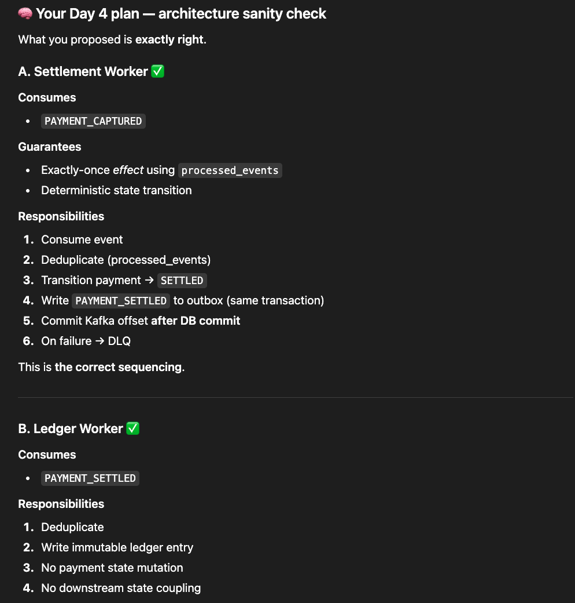
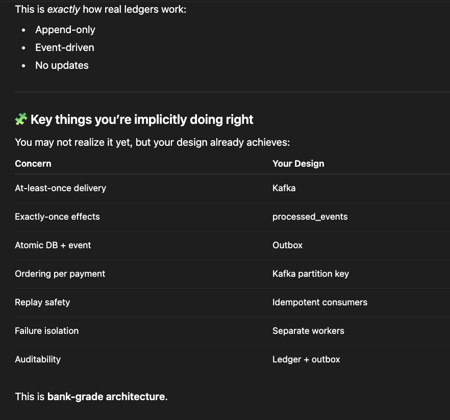

Kafka consumers must be idempotent.
### 5. Settlement Worker – Design
Flow
```psql
Kafka message PAYMENT_CAPTURED
  ↓
Check processed_events
  ↓
Begin transaction
  ↓
Verify payment state == CAPTURED
  ↓
Update state → SETTLED
  ↓
Insert processed_events(event_id)
  ↓
Insert outbox PAYMENT_SETTLED
  ↓
Commit

```

### 6. Ledger Worker – Design
Flow
```psql
Kafka message PAYMENT_SETTLED
  ↓
Check processed_events
  ↓
Begin transaction
  ↓
Insert ledger entry
  ↓
Insert processed_events(event_id)
  ↓
Commit
```